# Grayscale image colorization

Course project of [Machine Learning for Finance](https://github.com/PHBS/2018.M1.MLF) at [PHBS](http://english.phbs.pku.edu.cn/). This project aims to realize automatic colorization of grayscale images. The
repository is where we develop algorithms. We welcome contributions if you are interested in our
project. For example, you can:

* [Submit bugs or issues](https://github.com/devon-ge/PHBS_MLF_2018/issues) to improve the performance of our model.
* [File pull requests](https://github.com/devon-ge/PHBS_MLF_2018/pulls) if you have better ideas.

## Team Members

* [Ge Desheng](https://github.com/devon-ge), student ID: 1701213756
* [Wang Yumeng](https://github.com/yumengwang123), student ID: 1701213112
* [Wu Gan](https://github.com/SuperWGAaron), student ID: 1701212974
* [Zhang Mingyu](https://github.com/myzhangcn), student ID: 1701213151

## Motivation

With the popularity of machine learning, a variety of applications are hoping to simplify
both our lives and jobs. The state-of-the-art machine learning methods in pattern recognition
enable humans to find the intrinsic relationship of things. For example, image recognition often
compares the gray scale of scanned picture with dataset for identificaiton. How to transform a
colorful picture to a grayscale one attracts attentions in algorithm research. This project, however,
intends to colorize a grayscale picture, i.e., regain the original image. We try to map grayscale to RGB
colors acorrding to gray scale distribution. Colorful pictures contains more
information (such as RGB pixels), thus contributing to better recognition. Also, we can apply this
colorization algorithm to repair old pictures.

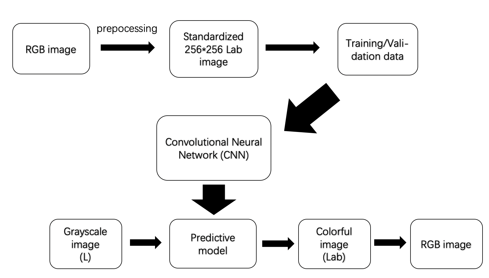

## Data and preprocessing

We obtian images of natural landscape by a spider. The pictures are classified by principal components analysis (PCA). convert original images to standardized 256 by 256 Lab images. The model receives colorful images and load them in grayscale. The neuron network then trains the samples and outputs colorized images.

### Images spider

Spider for this project are implemented under the [`Scrapy`](https://scrapy.org/) framework. Roughly speaking, a `Scrapy` project is nothing but a folder that contains auto-generated files (incluing `items.py`, `middlewares.py`, `pipelines.py` and `settings.py` under `PROJECT_NAME` folder, and spider(s) under `spiders` folder).

Among these, we mainly config in `items.py` and `settings.py`. [`items.py`](tooopen_img/tooopen_img/items.py) confines the crawling field (the spider only extract fields defined in this file). [`settings.py`](tooopen_img/tooopen_img/settings.py) contains project-specific configurations. More info on [Scrapy Tutorial](https://docs.scrapy.org/en/latest/intro/tutorial.html).

Pictures are crawled by the spider [`tooopen`](tooopen_img/tooopen_img/spiders/tooopen.py
) from the [nature category of **Toopen**](http://www.tooopen.com/img/87.aspx) (A website that posts categorized pictures). All pictures are name by the SHA1 hash of its url and stored in [`images/full`](images/full) directory (default of `Scrapy`).

To reproduce the crawling, just clone this repository and run spider `tooopen` via `Scrapy` command in terminal.

1. Clone this repository to your local disk

    `$ git clone https://github.com/devon-ge/PHBS_MLF_2018.git`

2. Change to `tooopen_img` directory (root directory of this scrapy project, should contain `scrapy.cfg` and this `README.md`)

    `$ cd PHBS_MLF_2018/tooopen_img`

3. Run `$ scrapy crawl tooopen[ -s CLOSESPIDER_ITEMCOUNT=60]`. The terminal should show the logs of crawling requests/response.

Now, you can view the pictures in [`images/full`](images/full) (a folder automatically generated by
scrapy under a project's root directory).

**Notes**: In step 3, `60` is the maximum number of item requests (can be set per the demand).
The spider will keep running until all pictures are crawled if we
omit the `CLOSESPIDER_ITEMCOUNT` option. That's time consuming!

Below are some examples:

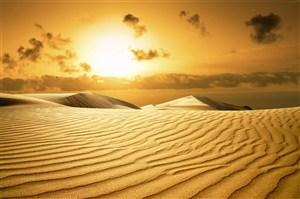 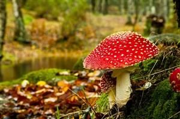

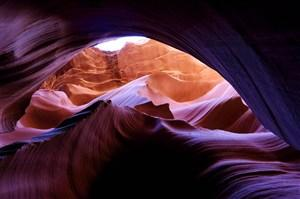 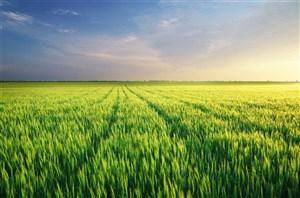

### A simple classifier

Once we get the data (images), we can start training the neuron network. To improve the accuray, we first build a classifier to classify pictures. For example, mountains and rivers pictures should be divided into separated groups. In this way, the model captures category-dependent features and thus should theoretically perform better than mixed training.

We use PCA score of RGB to represent each picture and then use k-means to cluster those images. Each time we will pick one group to create the trainning and test set. Thus make sure trainning and test images are similar to a certain degree without the extra effort of classification by human.

### Color channels conversion

First, to reduce computational intensity and improve the efficiency of the model, RGB images are resized to 256 by 256. Then, we convert the image format from `RGB` to `Lab`. Below are details of the conversion process.

* Convert color channels of images from `RGB` to `Lab`. In `Lab` format, `L` is lightness, ranging from 0(black) to 100(white), `a` is the green/red channel, ranging from -128 to 127, and `b` is the blue/yellow channel, ranging from -128 to 127. The conversion from `RGB` to `Lab` is invertible. It is easier to train two color channels in Lab than three channels in RGB, and `a` and `b` are uncorrelated.

* The convolution neural network inputs grayscale images (images with the L channel), and outputs the other two color channels, i.e., a and b. Then, L, a, and b are concatenate together, and full color images are retrieved. Last, images are converted from `Lab` back to `RGB`.

:octocat:|Raw|Compressed (width=256 px)
---|---|---
Gray| | 
RGB| | 

* Images are divided into test sets and training sets by a certain proportion.

## Neural network training

### CNN structure

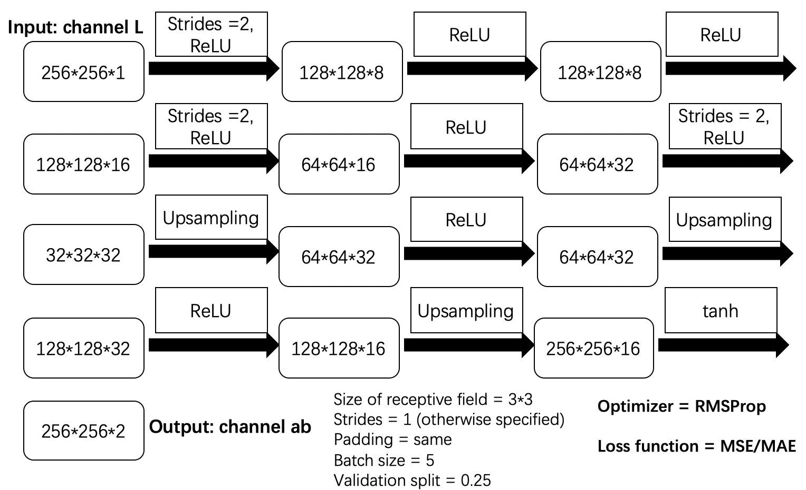

### Build CNN model based on Keras

* The picture below shows the process of some popular optimizers intuitively. (eg. SGD, Momentum, NAG, Adagrad, Adadelta, Rmsprop)
* In our model, we use Rmsprop method, which is an adaptive learning rate method and proposed by Geoff Hinton.

* Below (right) shows the optimization process.

### Result

After we train the model, the following pictures shows the colorizing result. It shows the gray picture, 50 times trainned result, 1000 times trained result and the original picture. The coloraziton is better when we increase the trainning times.  

:octocat:|1|2|3|4|5|6|7|8|9|10
---|---|---|---|---|---|---|---|---|---|---
Gray|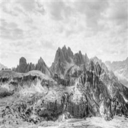 |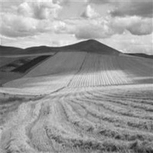|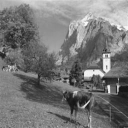|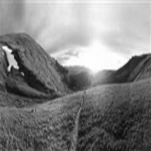|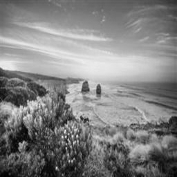|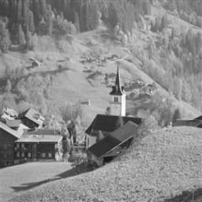|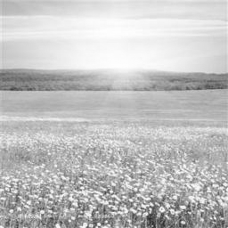|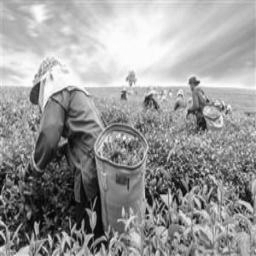|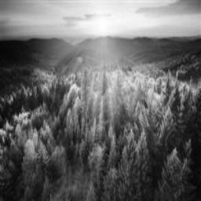|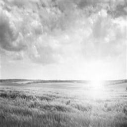
RGB (50 times)|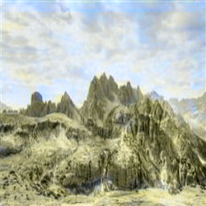 |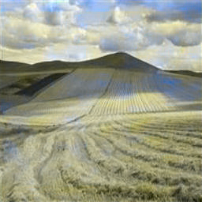|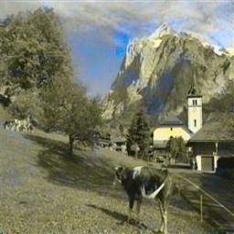|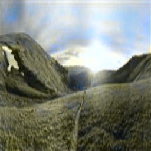|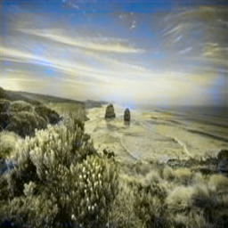|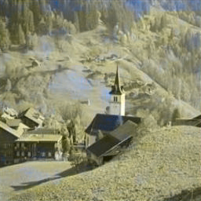|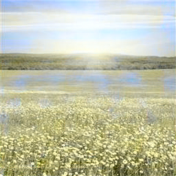|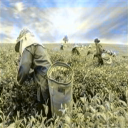|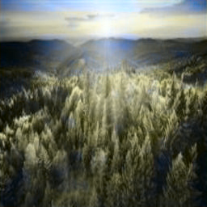|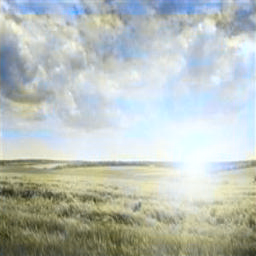
RGB (1000 times)|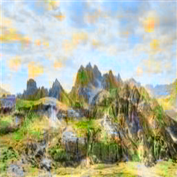 |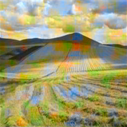|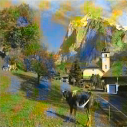|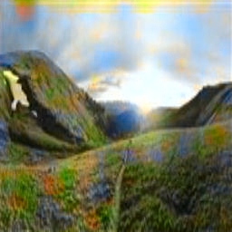|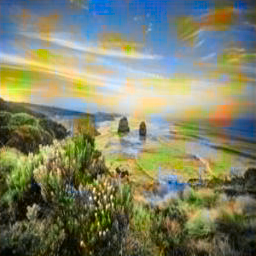|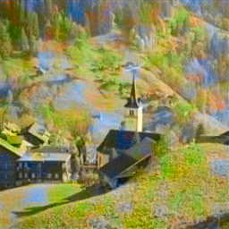|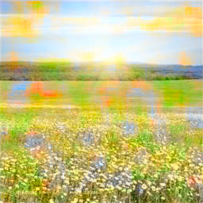|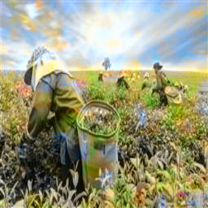|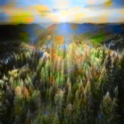|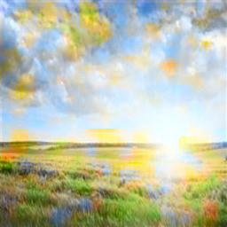
RGB (Original)|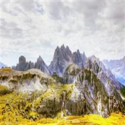 |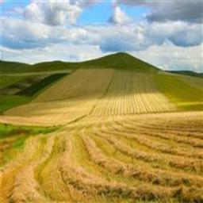|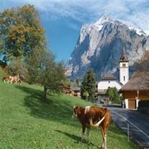|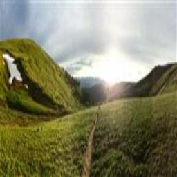|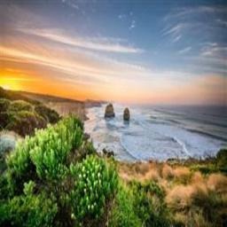|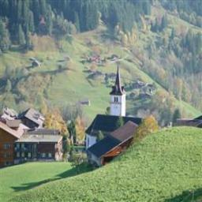|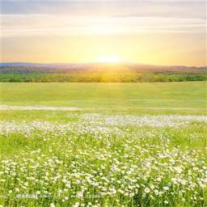|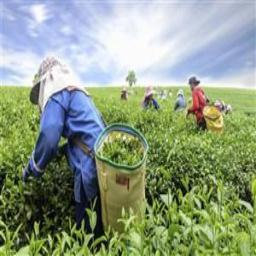|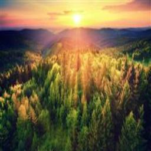|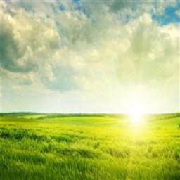

## Improvement in the future

1. The performance of classfier can be improved in the future, more high quality samples and training times will improve the performance. Using the classify network trained by google is a potential way to improve.

2. Loss function is another thing that can be improved. Current loss function is "MSE", "MAE". Considering the unsupervised network loss and the classification loss.

3. CNN topological structures and inner parameters can be improved by using  optimization algorithm.

4. In order to get a better performance, we can add mannual operations (eg. mark some pixs with specific colour which is decided by human and so on)

## Reference

Zhang, R., Isola, P., & Efros, A. A. (2016, October). Colorful image colorization. In European Conference on Computer Vision (pp. 649-666). Springer, Cham.