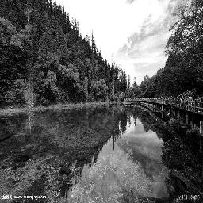
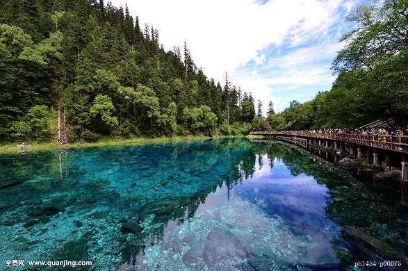

# Grayscale coloring

Course project of [Machine Learning for Finance](https://github.com/PHBS/2018.M1.MLF) at [PHBS](http://english.phbs.pku.edu.cn/). This project aims to realize automatic colorization of grayscale images. The
repository is where we develop algorithms. We welcome contributions if you are interested in our
project. For example, you can:

* [Submit bugs or issues](https://github.com/devon-ge/PHBS_MLF_2018/issues) to improve the performance of our model.
* [File pull requests](https://github.com/devon-ge/PHBS_MLF_2018/pulls) if you have better ideas.

## Team Members

* [Ge Desheng](https://github.com/devon-ge), student ID: 1701213756
* [Wang Yumeng](https://github.com/yumengwang123), student ID: 1701213112
* [Wu Gan](https://github.com/SuperWGAaron), student ID: 1701212974
* [Zhang Mingyu](https://github.com/myzhangcn), student ID: 1701213151

## Motivation

With the popularity of machine learning, a variety of applications are hoping to simplify
both our lives and jobs. The state-of-the-art machine learning methods in pattern recognition
enable humans to find the intrinsic relationship of things. For example, image recognition often
compares the gray scale of scanned picture with dataset for identificaiton. How to transform a
colorful picture to a grayscale one attracts attentions in algorithm research. This project 
intends to colorize a grayscale picture, i.e., regain the original image. We try to map grayscale to RGB
colors acorrding to gray scale distribution. Colorful pictures contains more
information (such as RGB pixels), thus contributing to better recognition. Also, we can apply this
colorization algorithm to repair old pictures.

## Data and preprocessing

We obtian images of natural landscape by a crawler program. In preprocessing, we convert original images to standardized 224 by 224 Lab images. The learning algorithm receives grayscale images as input, and output colorized images.

1. Compress all sample images into size of 224 by 224. The standardization saves computation power and facilitates following algorithm.

:)|Raw | Compressed (width=256 px)
---|---|---
Gray| | 
RGB| | 

2. Convert the color channel of images from RGB to Lab. In Lab format, L is lightness, ranging from 0(black) to 100(white), a is the green/red channel, ranging from -128 to 127, and b is the blue/yellow channel, ranging from -128 to 127. The conversion from RGB to Lab is invertible. It is easier to train two color channels in Lab than three channels in RGB, and a and b are uncorrelated.

3. Images are divided into test sets and training sets by a certain proportion.
