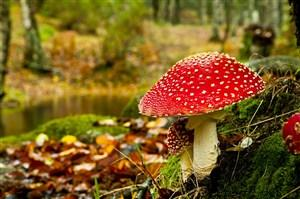

# This is the spider to crawl pictures

The pictures we crawled from [**Toopen**](http://www.tooopen.com/img/87.aspx) are stored
in [`images/full`](../images/full) directory. Every picture's name is the SHA1 hash of its url.

The following steps helps you to reproduce the result.

1. Clone this repository to your local disk

    `git clone https://github.com/devon-ge/PHBS_MLF_2018.git`

2. Change to `tooopen_img` directory (root directory of this spider that contains `scrapy.cfg` and this `README.md`)

    `cd PHBS_MLF_2018/tooopen_img`
3. Run command `scrapy crawl tooopen[ -s CLOSESPIDER_ITEMCOUNT=60]`

Now, you can check the pictures in [`images/full`](../images/full) (automatically generated by
scrapy).

**Warning**: If we omit the option `-s CLOSESPIDER_ITEMCOUNT=60` in step 3, where `60` is the
maximum number of item requests, the spider will keep running until all *nature* pictures
are crawled. That'stime consuming!

Below are some examples

 

 